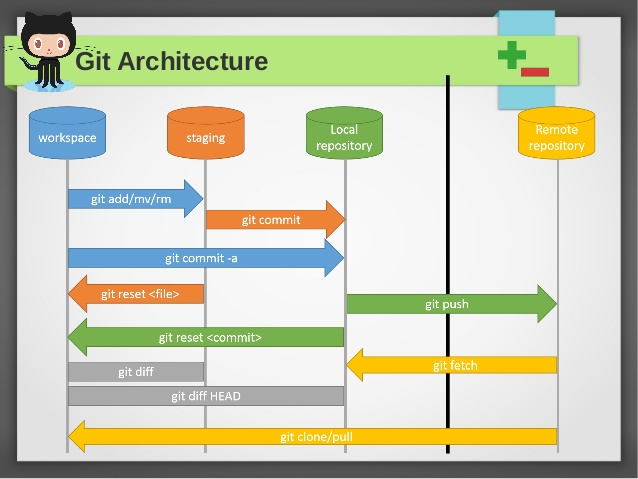

# Git ALL

## 1. Git flow


* Workspace: workspace/working directory đề cập đến khu vực của dự án nơi bạn đang làm việc. Nó chứa tất cả các tệp và thư mục của dự án mà bạn đang phát triển
* Staging/Index: là một khu vực trung gian nơi bạn có thể sắp xếp các thay đổi mà bạn muốn cam kết (commit) vào lịch sử của dự án.
* Local repository: Kho chứa cục bộ là nơi lưu trữ lịch sử đầy đủ của tất cả các thay đổi và các bản commit trong dự án.
* Remote repository: là một phiên bản của dự án được lưu trữ trên máy chủ hoặc dịch vụ từ xa (như GitHub, GitLab, Bitbucket, v.v.), giúp cho nhiều người có thể cộng tác và chia sẻ mã nguồn từ các địa điểm khác nhau

**Flow:**
>[Workspace] --> git add --> [Staging Area] --> git commit --> [Local Repository] --> git push --> [Remote Repository]

## 2. Git Remote repository
### 2.1. Git clone
>Lệnh này tạo một bản sao của toàn bộ kho chứa từ xa vào disk máy tính, **bao gồm toàn bộ lịch sử commit**.

```sh
git clone https://github.com/user/repository.git
```

### 2.2. Git fetch
>Lệnh git fetch sẽ lấy **tất cả các thay đổi mới** từ remote repository về máy tính của bạn, nhưng **không hợp nhất (merge) chúng vào nhánh hiện tại**. Tạo và cập nhật **các tham chiếu địa phương (local references)** cho các nhánh remote, điều này cho phép bạn kiểm tra các thay đổi từ xa trước khi áp dụng chúng vào dự án của mình.

* Fetch tất cả branch + tất cả remote alias
```sh
git fetch
```

* Fetch tất cả branch trong origin remote alias
```sh
git fetch origin
```

* Fetch branch main trong origin remote alias
```sh
git fetch origin main
```


### 2.3. Git pull
>lệnh git pull kết hợp hai bước: **fetch và merge**. Nó lấy các thay đổi từ remote repository và hợp nhất chúng vào nhánh hiện tại của bạn. Đây là cách thường dùng để cập nhật nhánh của bạn với các thay đổi mới nhất từ remote repository.
* Fetch tất cả branch + tất cả remote alias + Merge **branch remote tương ứng** vào **branch local tương ứng** 
```sh
git pull
```

* Fetch tất cả branch trong origin remote alias + Merge **branch remote tương ứng** vào **branch local tương ứng** 
```sh
git pull origin
```

* Fetch branch main trong remote alias + Merge branch **main remote** vào **branch hiện tại** ở local. Ví dụ đang ở develop thực hiện lệch này sẽ merge ở main remote vào local develop
```sh
git pull origin main
```

### 2.4. Git remote
>Là lệch để quản lý và thao tác với remote repository. **origin là alias mặc định** của remote repository khi clone.
List alias
```sh
git remote -v
```

Add alias
```sh
git remote add gitlab https://gitlab.com/user/repository.git
```

Đổi tên alias
```sh
git remote rename origin github
```

Xoá alias
```sh
git remote remove gitlab
```

**Thao tác 1 local repository với nhiều remote repository (ví dụ github và gitlab)**
>clone -> add new remote alias -> push to new alias

* Step1: Chuẩn bị local repository từ đầu hoặc sử dụng từ github/gitlab
```sh
git clone https://github.com/user/repository.git
```
* Step2: Tạo mới alias cho gitlab (tiền đề cần repo trên gitlab.com)
```sh
git remote add gitlab https://gitlab.com/user/repository.git
```

* Step3: Push code lên remote repository khác (nếu không branch main được protected thì cần tạo branch mới và pull request)
```sh
git push gitlab
```


## 3. Git Local repository
### 3.1. Git init
>Khởi tạo một repository Git mới hoặc chuyển một thư mục hiện có thành một repository Git. Tạo ra folder .git. Git init không tự động tạo .gitignore 
```sh
git init
```
### 3.2. Git add
>Thêm các thay đổi từ working directory vào staging area để chuẩn bị cho commit.
```sh
git add <file_path>
```

Add tất cả các file
```sh
git add .
```

Add các file chỉ định
```sh
git add folder1/ folder2/file1.txt
```

### 3.3. Git commit
>Lưu trạng thái hiện tại của staging area vào local repository với một message commit.

Commit không có nội dung
```sh
git commit
```

Commit có nội dung
```sh
git commit -m "Nội dung commit"
```

### 3.4. Git status
>Hiển thị trạng thái của working directory và staging area.

```sh
git status
```

### 3.5. Git log
>Hiển thị lịch sử các commit trên nhánh hiện tại.

```sh
git log
```

### 3.6. Git branch
>Thao tác các branches hiện có trong repository local.

Hiện thị các branch ở local
```sh
git branch
```


### 3.7. Git checkout
>Đặt lại HEAD tới một commit cụ thể và chuyển các thay đổi từ staging area trở về working directory.

Chuyển đổi branch
```sh
git checkout <branch_name>
```

Tạo branch mới
```sh
git checkout -b <branch_name>
```

### 3.8. Git reset
>Đặt lại HEAD tới một commit cụ thể và chuyển các thay đổi từ staging area trở về working directory.

```sh
git reset <commit_hash>
```

### 3.9. Git revert
>Tạo một commit mới để đảo ngược một commit đã tồn tại trước đó.

```sh
git revert <commit_hash>
```

### 3.10. Git merge
>Hợp nhất các thay đổi từ một branch vào branch hiện tại.

```sh
git merge <branch_name>
```
